This is the second post in a short series on finite recursive type aliases in Pony. The [first post](/blog/posts/eleven-years-to-a-finite-recursive-type-alias.md) told the story of why this took eleven years. As I write this, the pull request that adds the feature is open and in review on ponyc. It hasn't merged yet. Details may shift before it does, but everything in this post is foundational. It should all hold.

So how does the compiler tell a finite recursive type alias from an infinite one?

The algorithm is Tarjan's strongly connected components. I'll walk through it. Then I'll show you the two checks I built on top of it.

<!-- more -->

## Recursive type aliases

A recursive type alias describes something like JSON. A JSON value is a string, a number, a boolean, null, an array of JSON values, or an object whose values are JSON values.

Notice what that definition does. It uses "JSON value" inside itself. An *array of JSON values* means an array of more JSON values. An *object whose values are JSON values* means an object full of more JSON values. To describe what one JSON value is, you have to talk about other JSON values.

You see it in actual JSON. Take a piece of data like this:

```json
{
  "name": "Pony",
  "tags": ["fast", "safe"]
}
```

The whole thing is a JSON value. It happens to be an object. The value for `tags` is also a JSON value, and that one happens to be an array. Inside the array, each entry is another JSON value. JSON values nesting inside JSON values, all the way down.

That's what makes the type recursive. The definition has to refer to its own name to say what it is.

Some recursive shapes are *finite*. JSON is one. You can build a JSON value — `null` is a perfectly good JSON value, no further recursion needed. The shape refers to itself, but a value doesn't have to keep unwrapping forever. It can stop.

Other recursive shapes are *infinite*. A type that says "a value of me is another value of me, with no way out" has no value you can build. There's no bottom to start from. The type doesn't describe anything you can put in memory.

Pony accepts the finite ones. The infinite ones get rejected by the compiler.

Here's a finite recursive type alias — the JSON value, in Pony:

```pony
type JsonValue is
  (String | F64 | Bool | None | Array[JsonValue] | Map[String, JsonValue])
```

`JsonValue` mentions itself inside `Array` and `Map`. To handle these aliases in the compiler, two things have to happen. Find the recursive relationships between aliases. Decide which of those describe finite types. That's the rest of this post.

## Mutual recursion

The compact form of `JsonValue` above keeps everything in one definition. Here's the same type written as three aliases instead:

```pony
type JsonValue is (String | F64 | Bool | None | JsonArray | JsonObject)
type JsonArray is Array[JsonValue]
type JsonObject is Map[String, JsonValue]
```

Same type, just spread out. `JsonValue` mentions `JsonArray` and `JsonObject`, both of which mention `JsonValue` back. That's mutual recursion. I'm going to use this version for the rest of the post because mutual recursion is easier to draw and reason about than the compact form.

A good way to express recursive alias relationships is as a graph. My example as a graph looks like this:

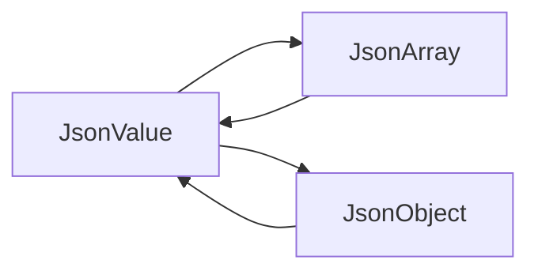

Nodes are alias definitions. An edge from `X` to `Y` means `X` mentions `Y` somewhere in its body. The recursion in this program — JSON value to JSON array and back, JSON value to JSON object and back — is a cycle in this graph.

I used Tarjan's strongly connected components algorithm to find them.

## Tarjan's Strongly Connected Components

A strongly connected component, or SCC, is a maximal group of nodes in a directed graph where every node can reach every other through directed edges. In the JSON graph above, `JsonValue`, `JsonArray`, and `JsonObject` form one SCC. Every one of them can reach the others by following arrows.

For contrast, look at a graph with two separate SCCs:

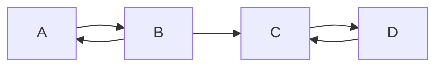

`A` and `B` cycle between themselves. So do `C` and `D`. The edge from `B` to `C` lets you walk forward across the gap but not back — there's no way to get from `C` or `D` back to `A` or `B`. Two SCCs, with a one-way road between them.

SCCs are exactly the thing we want, because every cycle in a graph has to live entirely inside one SCC. A cycle that crossed between SCCs would mean those two SCCs could reach each other, which would mean they were really one SCC, not two. SCCs don't overlap. So if you find every SCC, you've cataloged every cycle.

In 1972, Robert Tarjan published an algorithm that finds every SCC in a directed graph by walking it once. Linear in the number of nodes plus edges.

As you walk the graph in depth-first order, you number each node by visit order. Call that number `index`. For each node, also track the smallest `index` reachable from it through any of its descendants. Call that `lowlink`. Two things update `lowlink`. A *back-edge* — an arrow pointing at a node that's still on the stack — pulls your `lowlink` down to that node's `index`. And when you return from a child, you take the min of your `lowlink` and the child's. When a node finishes with `lowlink` equal to its own `index`, it's the root of an SCC. Pop the stack down to it. That's one component.

Trace it on the JSON graph.

Start at `JsonValue`. Give it `index = 0`, `lowlink = 0`. Push it on a stack.

```text
Stack: [JsonValue]
```

`JsonValue` points at `JsonArray`. Walk there. `JsonArray` gets `index = 1`, `lowlink = 1`. Push.

```text
Stack: [JsonValue, JsonArray]
```

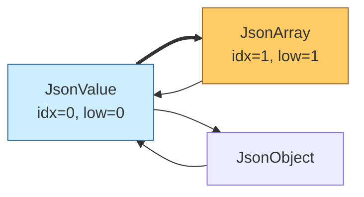

`JsonArray` points at `JsonValue`. `JsonValue` is already on the stack — that's a back-edge. Pull `JsonArray`'s `lowlink` down to `JsonValue`'s `index`, which is 0. `JsonArray` is now `(index = 1, lowlink = 0)`.

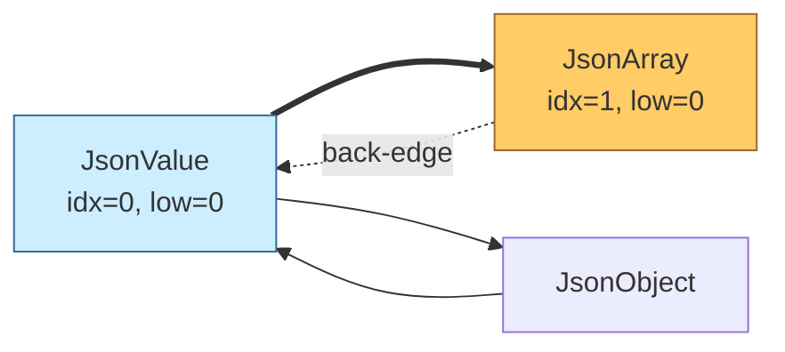

Done exploring `JsonArray`. Its `lowlink` (0) doesn't equal its `index` (1), so it's not the root of an SCC. Return to `JsonValue`. On the way back, take the min of `JsonValue`'s `lowlink` (0) and `JsonArray`'s `lowlink` (0). Still 0.

`JsonValue` points at `JsonObject` too. Walk there. `index = 2`, `lowlink = 2`. Push.

```text
Stack: [JsonValue, JsonArray, JsonObject]
```

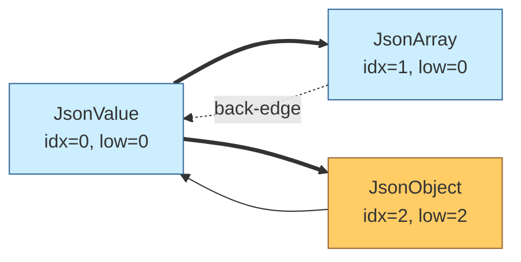

`JsonObject` points at `JsonValue`. Back-edge again. `JsonObject`'s `lowlink` drops to 0.

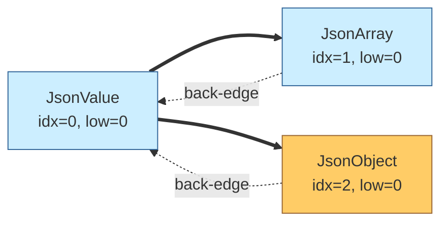

Done with `JsonObject`. Return. Min propagation keeps `JsonValue`'s `lowlink` at 0.

Done with `JsonValue`. Its `lowlink` is 0 and its `index` is 0. Root. Pop the stack down to it.

```text
Pop: JsonObject, JsonArray, JsonValue
Stack: []
```

That's the SCC.

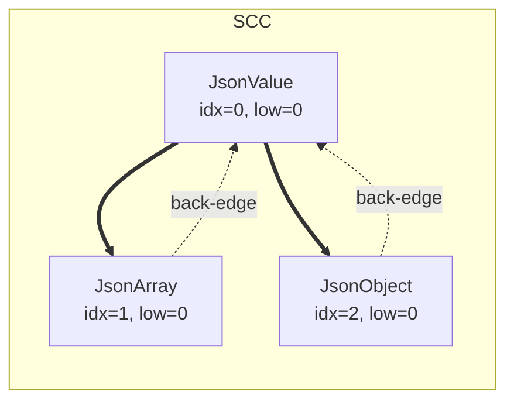

That's enough Tarjan to follow the rest of this post. If you want the full algorithm, [the Wikipedia page](https://en.wikipedia.org/wiki/Tarjan%27s_strongly_connected_components_algorithm) is good, and [Tarjan's original 1972 paper](https://epubs.siam.org/doi/10.1137/0201010) is a classic and not very long.

The compiler pass for recursive type aliases starts by building the alias graph and running Tarjan over it. Out comes every SCC.

## The finiteness checks

Tarjan finds cycles. It doesn't tell us which cycles are finite and which aren't. A cycle through aliases could be `JsonValue → JsonArray → JsonValue`, which is fine. Or it could be `A → A`, which isn't.

Two checks decide, one per rule. They run on each SCC that has a cycle.

### Constructive and non-constructive edges

The first rule is about value layout — where the bytes of a value of this type actually sit. The recursion has to cross something that holds its contents behind a heap pointer. `Array[X]` is fine. An array is a class, a class is a heap object, the `X` lives behind the pointer the array carries. Bare `X` in a union arm is not fine. Picture a value of `X` where the union resolves to the recursive arm — the value is another `X`. There's no pointer in front of it, no class boundary holding it somewhere else. The inner `X` sits directly in the same space the outer `X` occupies. And if that inner `X` resolves to the recursive arm too, you need yet another `X` inside that one. The bytes go up by one full `X` worth at every level. No finite-size value layout can hold something like that.

Here's the failure mode:

```pony
type A is (A | None)
```

Illegal. The `None` arm is an exit. But the recursive arm `A` sits bare in the union. A value of `A` is either `None`, or another `A`, which is either `None`, or another `A`. There's no boundary you can put the recursive part behind. The compiler rejects it.

The graph I described earlier is too coarse to catch this. An edge from `X` to `Y` doesn't say enough. To answer the rule, we need to know *where* in `X`'s body the mention of `Y` shows up.

Two cases:

- `Y` is inside `Array[Y]`, or any class's type arguments. The class is a heap object. `Y` lives behind its pointer. The recursive reference has a place to live. Call this edge **constructive**.[^naming]
- `Y` is at the top of `X`'s body, in a union or intersection arm of `X`'s body, in a tuple slot at the body's top level, or on the right side of a viewpoint arrow. There's no class boundary in the way. To build an `X` you'd have to inline `Y` straight into `X`'s value layout. Call this edge **non-constructive**. (A tuple *inside* a class's typeargs — like `Array[(A, None)]` — doesn't make `A` non-constructive. The class breaks the recursion at the heap pointer regardless of the tuple wrapping.)

Each edge now carries one of these two labels. The JSON graph from earlier, with the labels filled in:

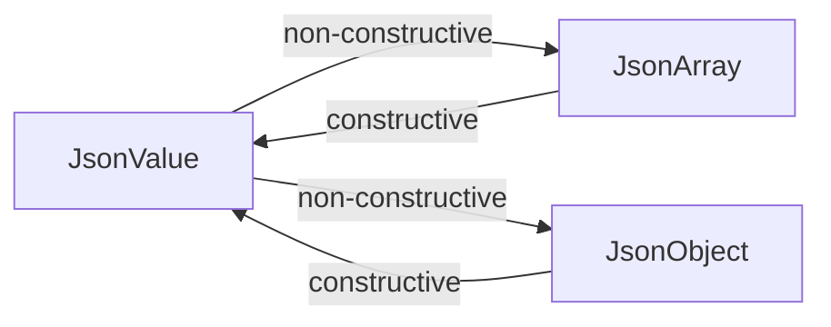

`JsonValue` mentions `JsonArray` and `JsonObject` in its union — non-constructive both times. `JsonArray` and `JsonObject` each mention `JsonValue` inside class typeargs (`Array[JsonValue]`, `Map[String, JsonValue]`) — constructive.

Compare with `type A is (A | None)`, the failure example from earlier:

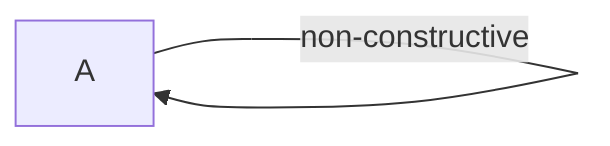

One self-loop, non-constructive. `A`'s only recursive reference sits bare in a union — no class boundary to put it behind.

A single source can have both kinds of edges going to the same target. `type X is (X | Array[X])` has both a non-constructive `X → X` edge (the bare `X` in the union) and a constructive one (the `X` inside `Array`).

For each SCC, look at just the non-constructive edges within that SCC. If they form a cycle on their own, there's a way to walk around the SCC without ever crossing a class boundary. The recursion has no place to live. The compiler rejects it.

The same rule, said another way: every cycle through the SCC has to cross at least one constructive edge.

There's a case the syntactic shape alone won't decide correctly.

```pony
type Wrap[T] is (T | None)
type X is Wrap[X]
```

`X` appears in `Wrap`'s type arguments. By the "inside a class's typeargs" rule earlier, that should be a constructive position. But there's a problem. `Wrap` isn't a class. It's an alias. There's no heap pointer involved. When you use `Wrap[X]`, the `X` ends up living wherever `Wrap`'s body puts it. And `Wrap`'s body puts its type parameter at the top of a union — a non-constructive position.

The right way to classify the edge from `X` through `Wrap[X]` is to look at how `Wrap` uses its own type parameter. Does `T` appear only at constructive positions inside `Wrap`'s body, only inside other classes' typeargs? Or does it appear at any non-constructive position — top, union, tuple, arrow RHS? If the second one, the edge is non-constructive. `Wrap[X]` is no better than spelling `(X | None)` out at the use site.

If `Wrap` doesn't reference its type parameter at all, no edge gets added. `T` is a phantom, and so is `X` in `Wrap[X]`.

As a graph, `Wrap` looks like this:

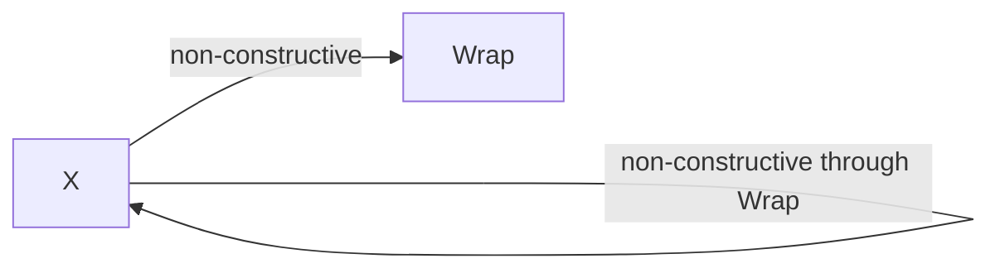

The self-loop on `X` is non-constructive — `Wrap`'s body inlines `T` at a union arm, so passing `X` through `Wrap`'s typearg doesn't put it behind any class boundary. `X`'s cycle has no constructive edge. Illegal, same shape of failure as `type A is (A | None)`.

For contrast, change one thing about `Wrap`:

```pony
type Box[T] is (None | Array[T])
type X is Box[X]
```

Now `T` lives inside `Array[T]` — a class's typeargs. Constructive. The edge from `X` through `Box[X]` is constructive too. And `Box`'s body has a `None` arm that gives `X` a base case. Legal.

As a graph:

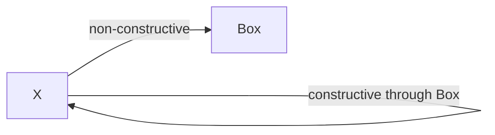

The self-loop on `X` is now constructive — `Box` puts `T` inside `Array`'s typeargs, so passing `X` through `Box`'s typearg puts it behind a class boundary. The cycle through `X` includes a constructive edge, so the first rule passes.

The point of the contrast: constructiveness is about value layout, not syntactic position. Class typeargs are constructive because a class is a boundary you build. Alias typeargs inherit whatever the alias's body does with its parameter.

### The base case check

The second rule is about whether you can build a value. You need a way out. Somewhere reachable from the type, there has to be a union arm that doesn't loop back. Otherwise no value of the type can be constructed at finite depth. There's nothing you can build first.

Here's the failure mode:

```pony
type A is Array[A]
```

Illegal. The recursion is constructive — `A` lives behind `Array`'s pointer, value layout is fine. But there's no exit. Every `A` value is an array of `A`s. To build one you have to build another, which means you have to build another. There's no smallest `A`. You can't start.

So the second check: for each alias in the SCC, walk its body looking for a union arm that doesn't lead back into the SCC. That's the base case. The value you can actually build first. Once you have one, you can wrap it in an array or put it in a map.

Only unions count. Tuples don't. Look at these two:

```pony
type A is (None | Array[A])
type B is (None, Array[B])
```

`A` is legal — same shape as `JsonValue` from earlier. The walker finds the union and sees `None` as a non-recursive arm. Base case.

`B` is illegal. The body is a tuple, not a union. To build a `B` you need a `None` *and* an `Array[B]`. The `None` slot doesn't save you because you still need a `B` for the other slot. The walker finds no union, no base case.

Unions let you pick one arm. Tuples make you pick all of them.

The walker steps through cross-SCC alias references as it goes. That's why `type X is Box[X]` from earlier — with `type Box[T] is (None | Array[T])` — is legal. `Box` isn't in any cycle on its own. It's a parameterized alias sitting in its own one-member SCC, off to the side. But `X` is in a cycle, because `X` references itself through `Box`'s typearg. When the walker looks for `X`'s base case, it walks `X`'s body, finds `Box[X]`, follows the reference into `Box`'s body, and lands in `(None | Array[T])`. There's the union. The `None` arm doesn't recurse back into `X`'s SCC. Base case for `X`, found inside an alias `X` doesn't even live in.

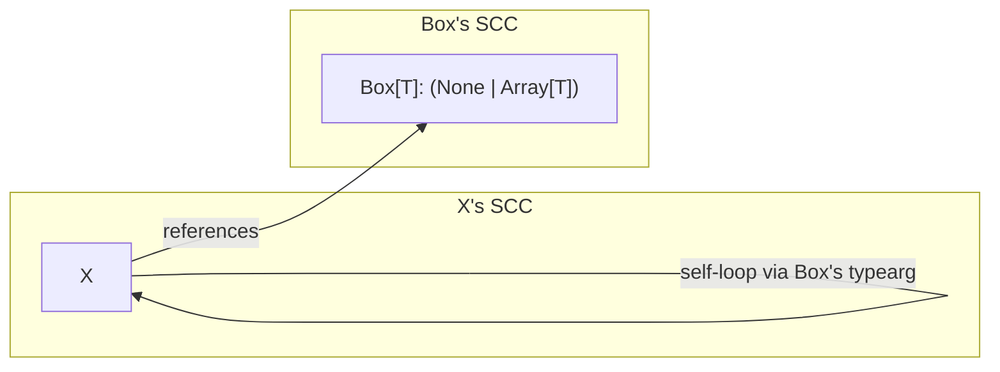

`X`'s self-loop sits in its SCC. The base case `X` needs lives across the edge to `Box`, inside `Box`'s body.

If you walk every alias in the SCC and can't find a base-case arm anywhere, the type is uninhabited. The compiler rejects it.

The recursion has to cross a class boundary, and somewhere along the way you need a union arm that doesn't recurse.

## The legality pass

That's the legality pass. It runs after name resolution, before flatten. It builds the alias reference graph, classifies each edge as constructive or not, runs Tarjan's SCC over the graph, and for each SCC with a cycle, runs the two checks. Pass both and you have a finite type. Fail either and the compiler tells you which cycle, and which rule, and why.

[^naming]: In the type theory literature, this rule has a standard name. A recursive type is **contractive** when its recursive variable only appears under a type constructor. Pierce's *Types and Programming Languages* covers it in the recursive types chapter. Same idea as what I'm calling "constructive." I'm using "constructive" instead because in Pony the boundary is specifically a class constructor — the `new` you call to build a value of a class. "Constructive recursion" names the rule for what it does in Pony. The math people use "contractive" because they're talking about the proof-theoretic shape. Same idea, different name, picked for the language.
