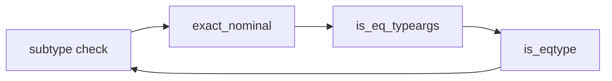
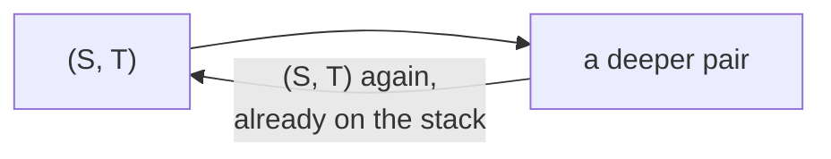
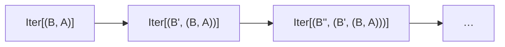
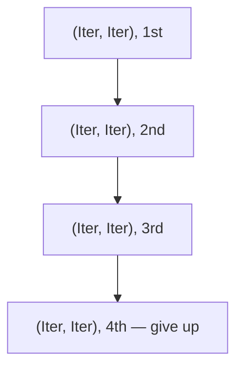

What comes around goes around. I'll tell you why, why, why, why.

That is, near enough, how the Pony compiler's subtype check works on a type that refers to itself. It follows the type down into its own structure, and for an ordinary self-referential type it soon comes back around to a pair it is already checking further up. That return is the exit. What comes around closes, and the check finishes.

This is a story about two types where the check went down and never came back around. One of them sent the compiler into a loop with no end. The other ran it off the end of its stack and knocked it over. One was reported in 2016, the other in 2021, and both closed in a single pull request.

<!-- more -->

Neither of the types is useful. The win here isn't a feature. The compiler now finishes — a real error or a clean compile — instead of looping or falling over.

## The hang and the crash

The hang came from an interface with a generic method:

```pony
interface Iter[A]
  fun enum[B](): Iter[(B, A)]
```

Theo Butler reported it in 2016. He was writing iterator combinators, and `enum` is the one that pairs each element with a running count. The compiler took the file and never gave it back. No error, no crash. It just ran.

The crash came from a generic function whose constraint mentions the very thing it constrains:

```pony
fun flatten[A: Array[Array[A]] #read](arrayin: Array[Array[A]]): Array[A] =>
  ...
```

Red Davies reported that one in 2021. He was writing a flatten for nested arrays. The compiler crashed. His words: "I accidentally'd the stack."

Both are recursive generic types. The type refers to itself through its own type arguments. `Iter` returns an `Iter` of something built from `A`. `A` is constrained to be an array of arrays of `A`. Neither is exotic. They are the kind of thing you write when you lean on generics.

## The assumption stack

To see why neither one finishes, start with the check that is running: the subtype check. Hand it a value of one type and a slot that requires another, and the subtype check tests whether the first can stand in for the second.

Most of the time the check finishes fast. The trouble starts when a type refers to itself. To check one `Iter` against another, the compiler compares their methods. Comparing a method means comparing its return type, and `enum`'s return type is another `Iter`. So checking an `Iter` leads to checking an `Iter`, which leads to checking an `Iter`. Left alone, it never stops.

The standard way out is to assume what you are trying to prove. The compiler keeps the checks in progress on a stack, the assumption stack. Starting a check on a pair `(S, T)` pushes the pair. Finishing it pops the pair. Before a new check descends, the compiler scans the stack for the same pair already in progress. If it is there, the check has come around to where it started, and it returns true instead of descending again. A loop that never turns up a contradiction is one that holds. That is co-induction, and it is how a subtype check terminates on a type that refers to itself.

Finding the matching pair is the whole game. The function that does it is `exact_nominal`. And `exact_nominal` had a trap in it.

The two types in a check carry type arguments, the `X` inside `Iter[X]`. To decide whether the pair about to be checked matched one already on the stack, `exact_nominal` compared those type arguments. It compared them by calling `is_eq_typeargs`, which tests whether the arguments are equal. And equality, for types, runs the full subtype check. The subtype check pushes a pair, scans the stack, and calls `exact_nominal` on every entry. Which calls `is_eq_typeargs`. Which runs the subtype check.



The step that was supposed to bound the recursion was running the recursion. I ran into the same trap in some [recent work on recursive type aliases](/blog/posts/making-finite-recursive-type-aliases-compilation-fast.md) — a comparison meant to be cheap that was quietly re-running the whole subtype check underneath. Different corner of the compiler, same mistake.

## Matching, not equality

Take Red's crash first, because it is the simpler of the two.

His `flatten` constrains `A` to `Array[Array[A]]`, and checking that constraint walks straight into that loop. Nothing on the way down matched anything already on the stack, so nothing stopped it. The same four frames repeated until the C stack gave out, more than a hundred thousand deep, and the compiler fell over.

The fix is to stop `exact_nominal` from running the subtype check at all. To break the loop, the compiler does not need the two type arguments to be equal. It only needs them to be the same, the same check already on the stack. That is a structural comparison: same kind of node, same definition, same arguments, walked directly, never calling the subtype check. Red wrote that comparison. It is a function called `exact_type` that compares definitions pointer by pointer and recurses into the type arguments on its own, and it never re-enters the subtype machinery. Put it in place of the `is_eq_typeargs` call and the descent is bounded. Red's crash is gone.

And once it compiles, `flatten` does nothing. `A: Array[Array[A]]` can't be satisfied by any type. It is arrays of arrays the whole way down, with no bottom to stand on. Red worked that out himself in 2021, before anyone fixed anything. The compiler doesn't make it work. It gives a plain type error instead of crashing.

## Looks equal, isn't

There is a wrong version of that structural comparison, and the first draft of the fix used it.

The quick way to compare two types structurally is to print them and compare the strings. Two types with the same printout are the same type. It is easy, and it is wrong. The printer writes a type parameter as its source name (`B` prints as `B`), no matter which scope it came from. Two different type parameters that happen to share the name `B`, from two different methods, print identically. A string comparison can't distinguish them.

That matters because the comparison is the thing that closes a co-inductive proof. Close the proof on a pair that only looks the same, and the compiler has accepted something it never checked. jemc caught it in review. The version that shipped compares the definitions themselves. Each type parameter points back at the declaration it came from, and two `B`s from two different methods point at two different declarations. Same name, different definition.

## A drift, not a cycle

`exact_type` ends Red's crash. It does not end Theo's hang.

Red's crash was the re-entry and nothing else. Take out the re-entry and the check is bounded. Theo's hang has the re-entry in it too, and taking it out helps, but underneath the re-entry there is a second thing, and the second thing is what keeps the hang going.

Look at what the check does on Theo's interface. Comparing one `Iter` against another means comparing their `enum` methods, and `enum` returns `Iter[(B, A)]` — an `Iter` with a bigger argument. Compare that one's `enum`, and the argument grows again. And again. It is the same `Iter` every time, but a bigger one, and it never repeats.

That is the difference between the two bugs, and it has a name worth keeping. Co-induction stops a check when it comes around — when the pair in hand matches a pair already on the stack. A type that loops back to a pair already there is a cycle, and co-induction was built for cycles:



Theo's interface never loops back. The argument is bigger every pass, so no pair ever matches one behind it, the assumption stack never fires, and the check walks away from where it started and keeps walking. That is a drift:



A cycle comes back around. A drift never does.

## Counting to four

You can't catch a drift by waiting for it to come around, because it never will. So the compiler counts instead.

Here is the rule that shipped. The assumption stack can hold the same pair of definitions more than once — `Iter` against `Iter`, again and again, with a bigger argument each time. The compiler counts those. If the same pair of definitions piles up four times on the stack without any two of them matching exactly, the compiler calls it a drift, stops, and reports that the subtype check couldn't be completed. Theo's interface trips the count and gets a plain error instead of a hang.



Why four? Because two wasn't enough. Pony's property-based testing library has real, legitimate types that drift for a couple of rounds before they come back around and close. Stop at two and you reject them. Three is the smallest number that doesn't, and four leaves a round of headroom. The number is tuned against actual code, and there is a comment on both ends, the compiler and the test library, so the next person to touch either one knows the two are tied together.

That rule can be wrong, and it is wrong on purpose. The compiler gives up after four. A type that would have closed on the fifth round gets a spurious error instead. The fix trades being always right for always finishing.

That trade is the whole point, and it runs deeper than this one guard.

You cannot write a checker for this that always finishes and always gives the right answer. Subtyping with generics that constrain and return themselves is enough rope to spell out a computation that runs forever, and no checker can determine, in general, which of those ever stop. Theo's `enum`, drifting to bigger and bigger tuples, is a small machine counting upward with no built-in reason to halt. This is not a Pony quirk. Pierce showed the subtyping in System F-sub undecidable back in 1994, and Grigore showed in 2017 that Java's generics are Turing complete. Pony is very likely no different. I have not proven its subtyping undecidable and I am not going to claim it here. But the guard — a depth cap, picked by hand, that stops even when stopping means being wrong — is what you build when the thing underneath can't be decided. You give up on always being right and settle for always stopping.

## Two masks

Two bugs, filed five years apart, by people who never compared notes. One compiler that looped with no end, one that fell over. They look like opposite failures. They are the same bug wearing two masks: the comparison that ran the whole subtype check instead of just matching against it. Theo found the mask that never stops, in 2016. Red found the one that falls down, in 2021. Neither knew they had found the same thing. One pull request took both.

What comes around goes around, and `exact_type` handles the things that do. But pull Theo's mask the rest of the way off, and there is a second face behind it that Red's bug never had — a check on a type that grows a little with every pass and walks away from itself for good.

You can't decide whether a walk like that ever ends. You can only refuse to follow it forever. So the compiler counts to four, and lets go.

This won't be the last of it. Sylvan filed [an issue](https://github.com/ponylang/ponyc/issues/1544) back in 2017, still open, where a generic that wraps itself in a bigger type on every call — `Pair[A]`, then `Pair[Pair[A]]`, and on from there — sends a different part of the compiler into the same kind of spin. Not the subtype check this time. Reachability analysis, the pass that works out which types a program actually uses, never reaching the end of the list. Another drift. I haven't looked closely. When I do, I expect it rhymes.
