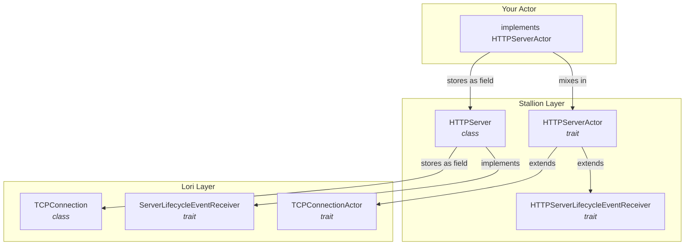
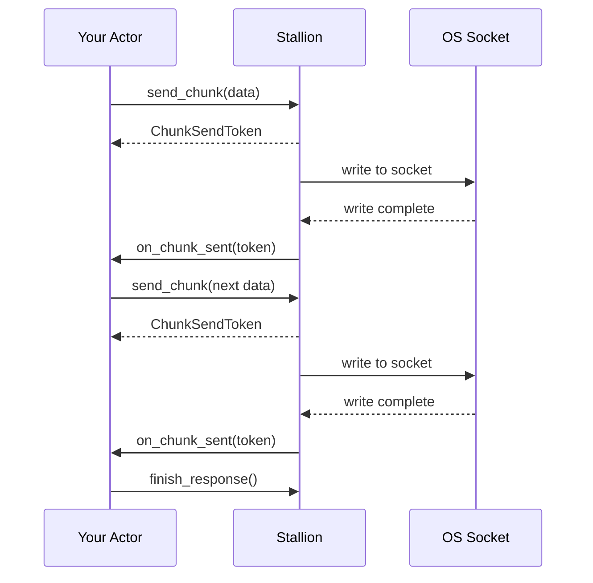
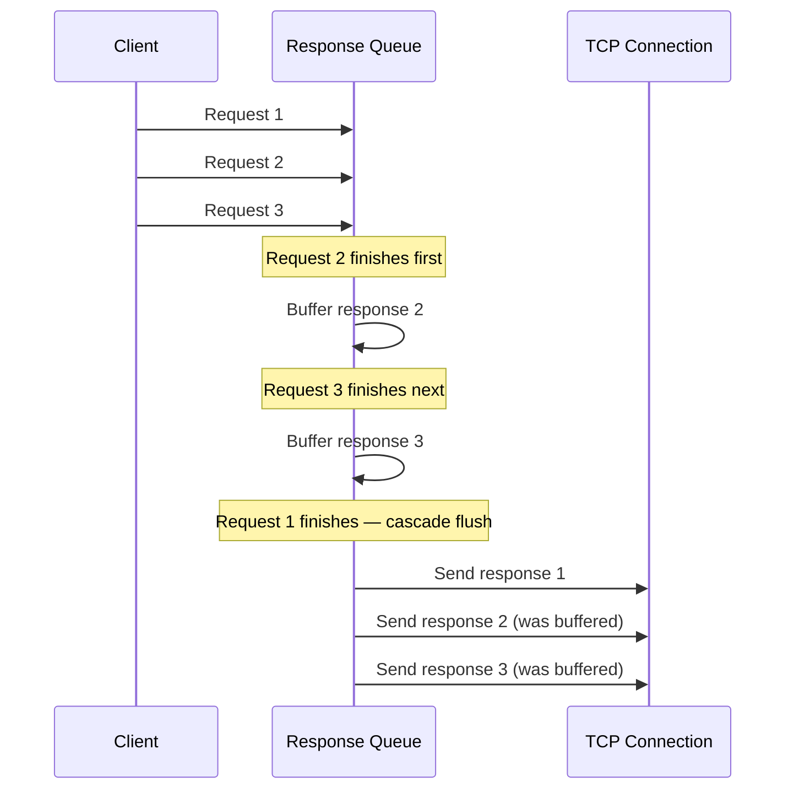

Last week I wrote about [lori](pony-networking-take-two.md) and the architecture behind Pony's new networking stack. The short version: your actor is the connection, the protocol machinery is a class you own, no hidden internal actors between you and the socket. If you haven't read that post, go do that first. Everything here builds on it.

[Stallion](https://github.com/ponylang/stallion) is an HTTP/1.1 server built on lori. Red has been running benchmarks comparing it against the old `http_server` package. Here's what he found, using 50 concurrent connections:

**16-byte response body:**

| Metric      | http_server | stallion |
|-------------|-------------|----------|
| Requests/s  | 441,570     | 710,416  |
| 50% Latency | 106µs       | 49µs     |
| 75% Latency | 125µs       | 84µs     |
| 90% Latency | 151µs       | 97µs     |
| 99% Latency | 1.89ms      | 1.45ms   |
| Transfer/s  | 34.11MB/s   | 54.88MB/s|

**100KB response body:**

| Metric      | http_server | stallion |
|-------------|-------------|----------|
| Requests/s  | 160,052     | 192,069  |
| 50% Latency | 254µs       | 211µs    |
| 75% Latency | 375µs       | 315µs    |
| 90% Latency | 0.97ms      | 0.9ms    |
| 99% Latency | 3.07ms      | 2.69ms   |
| Transfer/s  | 15.27GB/s   | 18.33GB/s|

A few caveats. These numbers only mean something relative to each other. The server and the wrk client were running on the same machine over localhost with keep-alive enabled, so don't go comparing them to your favorite web framework's benchmarks. And this is actually the best-case matchup for the old stack. The benchmark is dead simple. Turn off keep-alive and most of the difference disappears because socket open/close overhead dominates everything else. <!-- more -->

Stallion's architectural advantage starts to show in more complicated applications where the old stack's extra actors and message hops actually cost you something.

Those numbers aren't the result of optimization heroics. They're what falls out of the architecture. If you want to dig into why design matters more than optimization, we wrote about that in the [Performance Cheat Sheet](../../use/performance/pony-performance-cheat-sheet.md#design-for-performance).

## The pattern stacks

Lori gives you three things: a class that owns the TCP connection (`TCPConnection`), a trait your actor satisfies (`TCPConnectionActor`), and a callback trait that delivers lifecycle events (`ServerLifecycleEventReceiver`). Your actor embeds the class, mixes in the traits, and it is the connection. That's one layer of protocol understanding: raw TCP.

Stallion adds HTTP on top using the exact same three-element structure:



`HTTPServer` is a class that owns the HTTP parser, the response queue, URI parsing, keep-alive decisions, all the HTTP machinery. It sits inside your actor as a field, just like `TCPConnection` sits inside `HTTPServer`. `HTTPServerActor` extends both `TCPConnectionActor` and `HTTPServerLifecycleEventReceiver`, so satisfying the HTTP trait automatically satisfies the TCP one too. Your actor implements `HTTPServerActor`, provides `_http_connection()` returning its `HTTPServer` field, and overrides the HTTP callbacks it cares about.

The minimal version is about 15 lines:

```pony
actor MyServer is stallion.HTTPServerActor
  var _http: stallion.HTTPServer = stallion.HTTPServer.none()

  new create(auth: lori.TCPServerAuth, fd: U32,
    config: stallion.ServerConfig)
  =>
    _http = stallion.HTTPServer(auth, fd, this, config)

  fun ref _http_connection(): stallion.HTTPServer => _http

  fun ref on_request_complete(request': stallion.Request val,
    responder: stallion.Responder)
  =>
    let response = stallion.ResponseBuilder(stallion.StatusOK)
      .add_header("Content-Length", "2")
      .finish_headers()
      .add_chunk("OK")
      .build()
    responder.respond(response)
```

That's a complete HTTP server actor. A separate listener actor implements `lori.TCPListenerActor` and creates one of these per accepted connection. No factory classes, no notify wrappers, no hidden actors shuttling messages around. The listener handles `_on_accept`, `_on_listening`, `_on_listen_failure`, and that's it. Stallion doesn't wrap lori's listener with an HTTP-specific one because there's nothing HTTP-specific about accepting a TCP connection.

The point isn't just that it's concise. It's that this pattern is how you build protocol libraries on lori. WebSocket, SMTP, whatever. Each layer adds protocol understanding without adding actors or message hops. The layers compose because they're all built the same way.

## The compiler is your co-pilot

One of the things I like about Pony is that you can use the type system to catch mistakes at compile time that other languages catch at runtime (or don't catch at all). Stallion leans into this in a few places.

### Building responses

`ResponseBuilder` is a [Typed State Builder](https://patterns.ponylang.io/creation/typed-step-builder). You start with a status code, add headers, finish the headers, add the body, and build the result. Each phase returns a different interface, so you can only call methods that make sense for where you are in the sequence:

```pony
let response = stallion.ResponseBuilder(stallion.StatusOK) // -> ResponseHeadersBuilder
  .add_header("Content-Type", "text/plain")                // -> ResponseHeadersBuilder
  .add_header("Content-Length", "5")                       // -> ResponseHeadersBuilder
  .finish_headers()                                        // -> ResponseBodyBuilder
  .add_chunk("Hello")                                      // -> ResponseBodyBuilder
  .build()                                                 // -> Array[U8] val
```

Try calling `add_chunk` before `finish_headers` and the compiler stops you. `ResponseHeadersBuilder` doesn't have an `add_chunk` method. You don't get a runtime error or a malformed response. You get a compile error. The wrong sequence of calls is unrepresentable.

The result is an `Array[U8] val`, an immutable byte array. You can build it once and reuse it across thousands of requests. Cache your 404 page at startup and hand the same bytes to every `Responder`. No per-request allocation, no re-serialization.

### Starting a streaming response

When you want chunked transfer encoding, `start_chunked_response()` returns a union type instead of a boolean or an error:

```pony
match responder.start_chunked_response(stallion.StatusOK, headers)
| stallion.StreamingStarted =>
  responder.send_chunk("first chunk")
| stallion.ChunkedNotSupported =>
  // HTTP/1.0 — chunked encoding wasn't part of the spec
  responder.respond(fallback_response)
| stallion.AlreadyResponded => None
end
```

The compiler won't let you ignore the HTTP/1.0 case. It won't let you forget that maybe you already started responding. You have to handle all three. And because they're primitives (not strings or error codes), you can't mix them up.

## Streaming that doesn't lie about backpressure

Streaming responses are table stakes for HTTP servers at this point. Backpressure is another story. A lot of libraries give you a `write()` call that accepts data, queues it internally, and hopes for the best. Go's `net/http` blocks the goroutine with no way to cancel. Node.js returns `false` from `write()` when the buffer is full, but nothing stops you from ignoring it. Python's aiohttp has a well-documented structural problem where the async model makes backpressure hard to propagate at all. Some libraries do better — Rust's hyper uses pull-based async with bounded channels, and Cowboy has a synchronous ack mechanism — but even among those, per-chunk delivery confirmation is rare.

Stallion gives you a concrete feedback loop. `send_chunk()` returns `(ChunkSendToken | None)`. When there's data to send, you get a token. When the OS has accepted those bytes into the socket buffer, `on_chunk_sent(token)` fires on your actor with that same token. You know exactly which chunk was delivered.

The streaming example shows the pattern:

```pony
fun ref on_request(request': stallion.Request val,
  responder: stallion.Responder)
=>
  match responder.start_chunked_response(stallion.StatusOK, headers)
  | stallion.StreamingStarted =>
    responder.send_chunk("chunk 1 of 5\n")
    _responder = responder
    _chunks_sent = 1
  // ...
  end

fun ref on_chunk_sent(token: stallion.ChunkSendToken) =>
  match _responder
  | let r: stallion.Responder =>
    _chunks_sent = _chunks_sent + 1
    if _chunks_sent <= 5 then
      r.send_chunk("chunk " + _chunks_sent.string() + " of 5\n")
    end
    if _chunks_sent == 5 then r.finish_response() end
  end
```

Send a chunk. Wait for the OS to confirm it. Send the next one. No timers, no manual buffer management, no guessing. The flow control is driven by the actual transport, not by the application pretending to know when the client is ready.



This is built on lori's `SendToken` mechanism, which I covered in [the lori post](pony-networking-take-two.md). The chunk token is stallion's HTTP-level wrapper around lori's TCP-level send tracking. Each layer adds its own protocol awareness to the same underlying feedback loop.

## Pipelining you don't have to think about

HTTP pipelining is one of those features that's easy to describe and annoying to get right. A client fires off requests 1, 2, and 3 on the same connection without waiting for responses. Your server has to send the responses back in order. If request 2 finishes first, tough. It waits.

Most servers punt on this. They either don't support pipelining or they serialize request processing so there's nothing to reorder. Stallion handles it internally so your application code never has to care. There's a response queue under the hood that tracks request ordering. Data for the head-of-line request goes straight to TCP. Everything else buffers. When the head finishes, the queue cascades: if the next response is already buffered, it flushes immediately, and the one after that, and so on. A burst of fast responses behind a slow one all drain in a single pass.



Backpressure plugs in at this layer too. When lori says the socket buffer is full, the queue buffers even the head request's data. When pressure releases, it drains. You get `on_throttled()` and `on_unthrottled()` callbacks if you want to react, but you don't have to. The queue does the right thing either way.

## What's here and what's next

Stallion is at [0.4.0](https://github.com/ponylang/stallion). If you want to kick the tires, the [examples](https://github.com/ponylang/stallion/tree/main/examples) are the place to start. There's a hello world with query parameter parsing, an SSL server, a streaming response demo with flow control, and a cooperative scheduling example showing `yield_read()` in action.

The stack keeps growing upward. [Hobby](https://github.com/ponylang/hobby) is a web framework being built on stallion. [Courier](https://github.com/ponylang/courier) is the HTTP client counterpart. Same architecture all the way through: classes inside actors, no hidden concurrency, the type system catching mistakes before your code runs.

The old `http_server` and `http` packages will eventually be retired. They got us here, but we've got something better now. The benchmarks agree.
